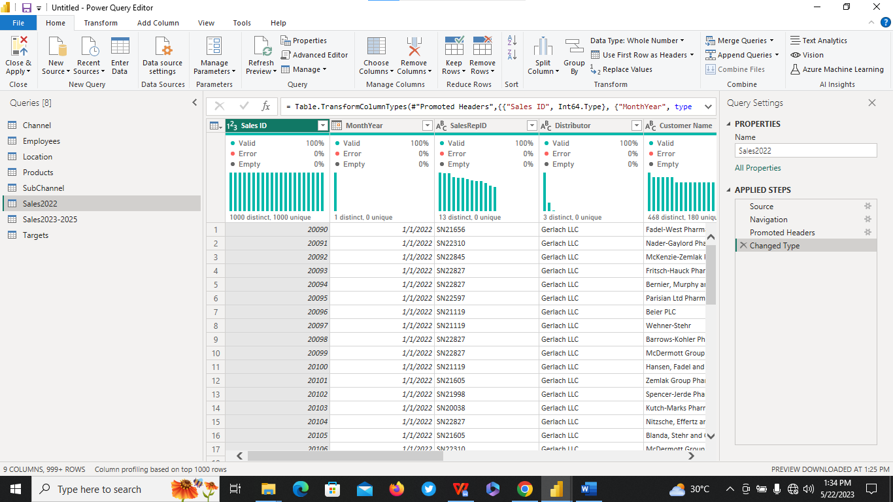
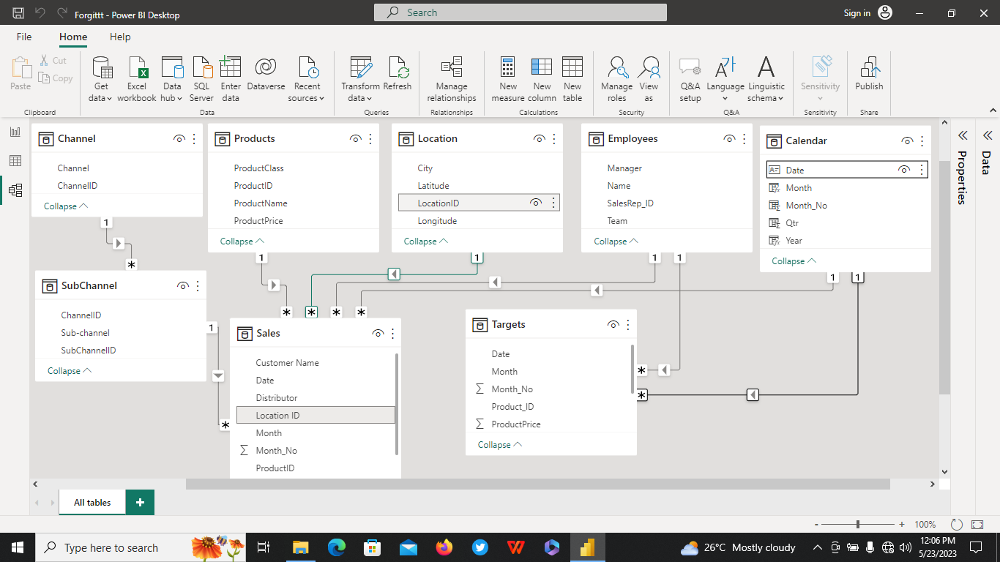

# Forggith_Pharmaceutical

## Introduction:
Forggith Pharmaceuticals (Forggith) is a fictitious Pharmaceutical Manufacturing company based in Germany. As a Manufacturing company, they produce medical drugs which get to the consumers through their Distributors.
Forggith provided a template for their distributors to capture records of their sales which are then sent to Forggith on a monthly basis. This data is then used for reporting and analysis by Forggith to achieve their goals Sales and Marketing objectives through tracking and monitoring of KPIs.
In their efforts to maximise growth, Forggith works with a team of Sales and Marketing pros who ensure retailers are able to get their products through the distributors. That is, Forggith does not sell directly to retailers or end-users, they sell to Distributors. But they maintain interaction with retailers, through their Sales and Marketing pros.

## Problem Statement:
Forggith is looking to create some Power BI Reports to assist in guiding their strategies, tactics and operations as a company. For a start, they have identified a couple of numbers they will like to report from their data as reports.

## DataSet:
The Raw DataSet are two (2)  Excel  files namely **PharmDataset** and **PharmTargets** provided by FORESIGHT BI.
The **PharmDataset** contains Seven (7) Tables,namely:
1. DimLocation
2. DimSubChannel
3. DimChannel
4. DimProducts 
5. DimEmployees
6. Sales 2022
7. Sales 2023-2025

While the **PharmTargets** contains just One (1) Table called Targets.

## Skills Demonstrated:
While the Datasets requires less Cleaning,the bulk and major challenges are in the area  of Transformation and Data consolidated .

## Data Transformation/Modelling:
The Target Tables contains information/records of Yearly/Monthly Product Target(Volume) assigned to each Sales representative as identified by the SalesRepID. This Table was duplicated four times for each  distinct year e.g 2022,2023,2024 and 2025 seperately.
Thereafter,the corresponding Tables were then Append to form a new Table from the hitherto seperate yearly Target Column.The Columns were edited and rename base on the information it contain.Conditional Column was used to create a new Year Column.
The Target Table was then merged with the DimProducts Table using the Primary/Foreign Key relationship of the ProductID Column in both Tables to get the Product Price.This is important in order to calculate the budgeted Target “Revenue”’.
The Month and Year Columns were duplicated.The Duplicated Columns were then merged to form a Date Column.

 Targets_before         |     Targets_after
:-----------------------|-----------------------:
 | 

Furthermore, the Sales 2022 and Sales 2023-202 Tables were append together to create a new Table that has Sales records from Year 2022 to 2025.The new Table was then merged with the DimProducts Table using the Primary/Foreign Key relationship of the ProductID Column in both Tables to get the Product Price.This is important in order to calculate the Actual Revenue.The MonthYear Column was duplicated and Transform to extract Year,Month and Quarter from the Table.

   Sales_before         |     Sales_after
:-----------------------|-----------------------:
   | 

##  Modelling:
 
 
 
 
 ##  Analysis and Visualization:
 
1.  The Sales Representative can track their performances through-out the periods to plan their marketing activities.
2. The Team Managers can track their teams' performances through-out the periods to plan their teams' activities.
3. Executive team can track Revenue numbers to monitor alignment with the set targets to influence medium to long term strategies.

 

.Sales Performance Overview:

1. Total  Revenue
2. Total Revenue Year To Date (YTD)
3. Total Revenue Previous Year YTD
4 . Total Revenue Same Period Last Year(SPLY)
5. Total Target
6. Total TargetYTD
7. Actual Revenue Performance Previous Year YTD vs Target Previous Year YTD
8. Actual Revenue Performance YTD vs Target YTD
9. Revenue Month on Month Percentage Change
10. Revenue Distribution by Location
11. Revenue by Channel
12. Revenue by Product Class

 Marketing Performance 
 
1. Revenue Achieved vs Revenue Target
2. Volume Achieved vs Volume Target
3. .Actual Revenue by Sales Representative
4. Target Revenue Achievement% by Sales Representative
5. Actual Volume by Sales Representative
6. Target Volume Achievement by Sales Representative
7. Actual Revenue Achievement by Sales Team
8. Revenue and Volume Achievement by Product.

## Report

The full Report of the Analysis is a Click away :point_right: (https://app.powerbi.com/view?r=eyJrIjoiMmY1ODg4NjgtZTA0OS00MWI1LWIwNmItNmZhZTg0Mjc3NzQ4IiwidCI6IjJlYWMyZjE5LTE1MWUtNGQzOC05NGUzLTlkYzg0YjYxNGJkNyIsImMiOjZ9)

## Conclusion/Recommendation:
The Stakeholder request was met and a report that speaks to their demands has been generated.

